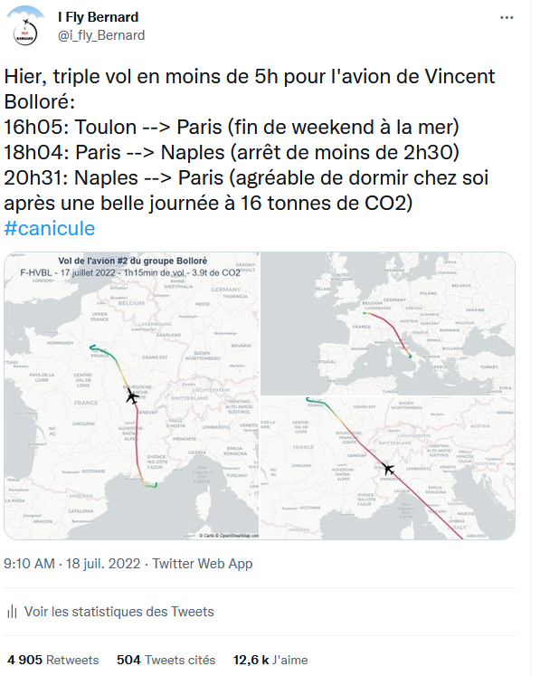

<h1 align="center">  </h1>

# i_fly_Bernard
Code du compte twitter [@i_fly_bernard](https://twitter.com/i_fly_Bernard). <br>
Suivi des jets privés de milliardaires, génération des trajectoires et calcul du CO2 émis en utilisant les données de [adsbexchange.com](https://globe.adsbexchange.com/).

Code comments and README.md are in French. I may translate everything in English, pending requests ;)

## Contexte du projet
<p align="justify"> Bonjour ! Les milliardaires détruisent la planète par leur mode de vie et la gestion climaticide de leur capital. 63 milliardaires français :fr: émettent autant de CO2 que 50% de la population (source Oxfam / Greenpeace 2022).

Ce compte Twitter (et ce code) ont pour humble ambition d'en exposer une petite partie en suivant les trajets de leurs avions privés ultra-polluants.</p>

## Exemple de tweet
<h1 align="center">
  <a href="url"></a>
  </h1>

## Prérequis
Principales libraries à installer (voir requirements.txt pour les versions):
* Python3
* Pandas
* Numpy
* Plotly
* PIL
* bs4
* selenium
* webdriver_manager
* geographiclib

## Struture et description du code
<p align="justify">La structure est simple: un script principal (main.py) qui gère automatiquement la séquence de recherche des nouveaux vols et qui appelle dans l'ordre logique les autres (adsb_exchange.py, kml_to_csv.py, get_new_df_data.py, csv_to_map.py,  maths_for_map.py et post_flight_data_consolidation.py).
Il utilise des données dans "/input/" et génère les résulats dans "/output/". Les 6 principaux scripts ont été commentés en français (et bientôt en anglais peut-être).</p>

Les autres scripts sont des aides manuelles pour exploiter des vols spécifiques.

```
root/
└─── main.py -> script principal qui, pour chaque avion dans "/input/avions.csv", utilise les autres scipts pour rechercher de nouveaux vols, générer les cartes et calculer le CO2 associé.
└─── README.md -> ce que vous êtes entrain de lire :)
└─── requirements.txt -> liste des dépendances (library + version)


└───root/module/
    └─── adsb_exchange.py -> script #2 qui scrap le site "https://globe.adsbexchange.com/" à la recherche de nouveau(x) vol(s). Si nouveau vol détecté, téléchargement du kml.
    └─── kml_to_csv.py -> script #3 qui déplace transforme le kml téléchargé à l'étape d'avant puis le transforme en csv
    └─── get_new_df_data.py -> script #4 qui détermine toutes les infos du vol (aéroports départs et arrivés, temps de vol, CO2 émis, etc)
    └─── csv_to_map.py -> script #5 qui utilise la trajectoire csv et les infos de "get_new_df_data.py" pour générer la carte de la trajectoire et/ou le html. Si absence de données pendant plus de x minutes, calcule de la géodésique pour combler le trou.
    └─── maths_for_map.py -> script #6 qui contient des fonctions mathématiques utilisées dans les autres scripts (surtout pour "csv_to_map.py").
    └─── post_flight_data_consolidation.py -> script #7 qui contient des fonctions de "post-traitement", principalement pour soulager le code principal

    └─── x_analysis.py -> script offline et séparé des autres, qui sert à générer les bilans mensuels. Travail de génération manuel principalement
    └─── y_multiple_flights_plot.py -> script offline et séparé des autres, qui sert à générer des plots spécifiques (par exemple pour twitter un cas où il y a eu 3 vols par jour ou un autre concernant un tour du monde)
    └─── y_split_flights_reconciliation.py -> script offline pour identifier s'il y des vols à réconcilier (à cause d'adsb-ex qui coupe les vols à minuit UTC) et les "fusionnent"
    └─── z_replot_maps.py -> script offline et séparé des autres, qui sert à regénérer facilement les plots d'un vol quand il y a eu un souci avec la version automatique


└───root/input/
    └───avions.csv  ->  liste des avions que le script doit utiliser
    └───airports.csv -> contient la liste des aéroports utilisés par "get_new_df_data.py"
    └───airplane_jet.png -> image utilisé par "csv_to_map.py" pour afficher un avion sur la trajectoire
    └───root/input/github_pictures -> images pour cette page


└───root/output/
    └───aircraft_xxx_folder/
         └───xxx_flight_data_all.csv -> contient tous les vols de "aircraft". Ce fichier est complété par "a_main.py" si nouveau vol trouvé
         └───root/output//date/ -> dossier contenant le kml, csv, jpg, html des vols de ce jour, par leg. Un exemple est donné pour F-GBOL et un pour F-HVBL.
    └───all_flights_data.csv -> simple pd.concat de chaque fichier "xxx_flight_data_all.csv"
```

## LICENSE
License MIT. Voir [LICENSE.md](https://github.com/GeneralDeGaulle/i_fly_bernard/blob/master/LICENSE.md)
